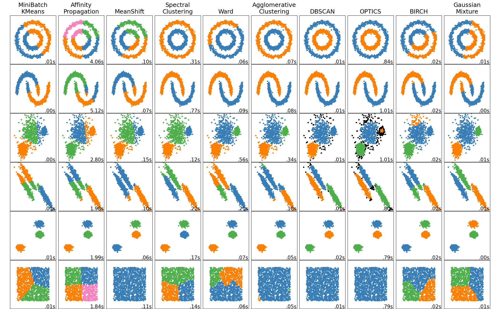

title: Introduction to scikit-learn: Machine Learning in Python
use_katex: True
class: title-slide

# Introduction to scikit-learn: Machine Learning in Python


.larger[Thomas J. Fan]<br>
@thomasjpfan<br>
<a href="https://www.github.com/thomasjpfan" target="_blank"><span class="icon icon-github icon-left"></span></a>
<a href="https://www.twitter.com/thomasjpfan" target="_blank"><span class="icon icon-twitter"></span></a>
<a class="this-talk-link", href="https://github.com/thomasjpfan/ml-workshop-intro" target="_blank">
This workshop on Github: github.com/thomasjpfan/ml-workshop-intro</a>

???

## Links

- https://scikit-learn.org/stable/
- https://github.com/thomasjpfan/ml-workshop-intro

---

name: table-of-contents
class: title-slide, left

# Table of Contents

.g[
.g-6[
1. [Introduction to Machine Learning](#introduction)
1. [Supervised Learning](#supervised)
1. [Preprocessing](#preprocessing)
1. [Pipelines](#pipelines)
]
.g-6.g-center[

]
]

---

name: introduction
class: chapter-slide

# 1. Introduction to Machine Learning

.footnote-back[
[Back to Table of Contents](#table-of-contents)
]

---

class: chapter-slide

# What is machine learning?

---

class: middle

# Traditional programming

## Prediction


---

class: middle

# Machine Learning

## Training


## Prediction


---

class: center

# Amazon Recommendations


---

class: center

# Higgs Boson


.footnote[
[Machine Learning Wins the Higgs Challenge](https://atlas.cern/updates/atlas-news/machine-learning-wins-higgs-challenge)
]

---


.footnote[
[Link to Source](https://www.broadinstitute.org/news/deep-learning-model-assesses-quality-stored-blood)
]

---

class: middle

# Types of Machine Learning

- Unsupervised Learning

- Reinforcement Learning

- Supervised Learning

---

# Unsupervised Learning



.footnote[
[Link to Source](https://scikit-learn.org/dev/auto_examples/cluster/plot_cluster_comparison.html#sphx-glr-auto-examples-cluster-plot-cluster-comparison-py)
]

---

# Reinforcement Learning


---

# Reinforcement Learning


.footnote[
[Link to Source](https://arxiv.org/abs/1912.06680)
]


---

name: supervised
class: chapter-slide

# 2. Supervised Learning

.footnote-back[
[Back to Table of Contents](#table-of-contents)
]

---

# Supervised Learning

$$
(x_i, y_i) \propto p(x, y) \text{ i.i.d}
$$
- $p$ is an unknown joint distribution
- i.i.d means independent identically distributed

$$x_i \in \mathbb{R}^p$$
$$y_i \in \mathbb{R}$$

## Goal during training
$$f(x_i) \approx y_i$$

---

# Generalization

## Goal during training
$$f(x_i) \approx y_i$$

## Generalization
$$f(x) \approx y$$

For *non-training data*: $x$

---

class: middle

# Classification and Regression

.g[
.g-6[
## Classification
- target $y$ is discrete
- Does the patient have cancer?
]
.g-6[
## Regression
- target $y$ is continuous
- What is the price of the home?
]
]

---

# Data Representation


---

# Loading Datasets

## Random datasets
```py
from sklearn.datasets import make_classification
from sklearn.datasets import make_regression
```

## Sample datasets
```py
from sklearn.datasets import load_breast_cancer
from sklearn.datasets import load_diabetes
from sklearn.datasets import load_digits
from sklearn.datasets import load_iris
from sklearn.datasets import load_wine
```

## OpenML

```py
from sklearn.datasets import fetch_openml
```

---

# Splitting Training and Test Data


---

class: chapter-slide

# Notebook 📒!
## notebooks/01-loading-data.ipynb

---

# Supervised ML Workflow


---

# Supervised ML Workflow


---

class: chapter-slide

# Notebook 📓!
## notebooks/02-supervised-learning.ipynb

---

name: preprocessing
class: chapter-slide

# 3. Preprocessing

.footnote-back[
[Back to Table of Contents](#table-of-contents)
]

---

# Housing Dataset


---

# Feature Ranges


---

class: chapter-slide

# Notebook 📕!
## notebooks/02-preprocessing.ipynb

---

# KNN Scaling


---

# KNN Scaling Decision Boundary


---

# Scikit-Learn API


.center[
## `estimator.fit(X, [y])`
]

.g[
.g-6[
## `estimator.predict`
- Classification
- Regression
- Clustering
]
.g-6[
## `estimator.transform`
- Preprocessing
- Dimensionality reduction
- Feature selection
- Feature extraction
]
]

---

name: pipelines
class: chapter-slide

# 4. Pipelines

.footnote-back[
[Back to Table of Contents](#table-of-contents)
]

---

# Why Pipelines?

- Preprocessing must be fitted on training data only!

## Bad
```py
scaler = StandardScaler()
X_train_scaled = scaler.fit_transform(X_train)
X_test_scaled = scaler.fit_transform(X_test)
```

## Good
```py
scaler = StandardScaler()
X_train_scaled = scaler.fit_transform(X_train)
X_test_scaled = scaler.transform(X_test)
```

---

# Pipeline Example

## Before

```py
scaler = StandardScaler().fit(X_train)
X_train_scaled = scaler.transform(X_train)

est = Ridge().fit(X_train_scaled, y_train)

# Evaluate on training data
X_test_scaled = scaler.transform(X_test)
est.score(X_test_scaled, y_test)
```

## After

```py
*from sklearn.pipeline import make_pipeline

pipe = make_pipeline(StandardScaler(), Ridge())

pipe.fit(X_train, y_train)
pipe.score(X_test, y_test)
```

---

# Pipeline Overview


---

class: chapter-slide

# Notebook 📕!
## notebooks/04-pipelines.ipynb

---

# Whats next?
## Intermediate Machine Learning with scikit-learn
- Cross Validation
- Parameter Tuning
- Pandas interoperability
- Missing Values

## Other Workshops
- Intermediate Machine Learning with scikit-learn: <br> *Evaluation, Calibration, and Inspection*
- Advanced Machine Learning with scikit-learn: <br> *Text Data, Imbalanced Data, and Poisson Regression*

---

class: title-slide, left

.g.g-middle[
.g-7[

1. [Introduction to Machine Learning](#introduction)
2. [Supervised Learning](#supervised)
3. [Preprocessing](#preprocessing)
4. [Pipelines](#pipelines)
]
.g-5.center[
<br>
.larger[Thomas J. Fan]<br>
@thomasjpfan<br>
<a href="https://www.github.com/thomasjpfan" target="_blank"><span class="icon icon-github icon-left"></span></a>
<a href="https://www.twitter.com/thomasjpfan" target="_blank"><span class="icon icon-twitter"></span></a>
<a class="this-talk-link", href="https://github.com/thomasjpfan/ml-workshop-intro" target="_blank">
This workshop on Github: github.com/thomasjpfan/ml-workshop-intro</a>
]
]
